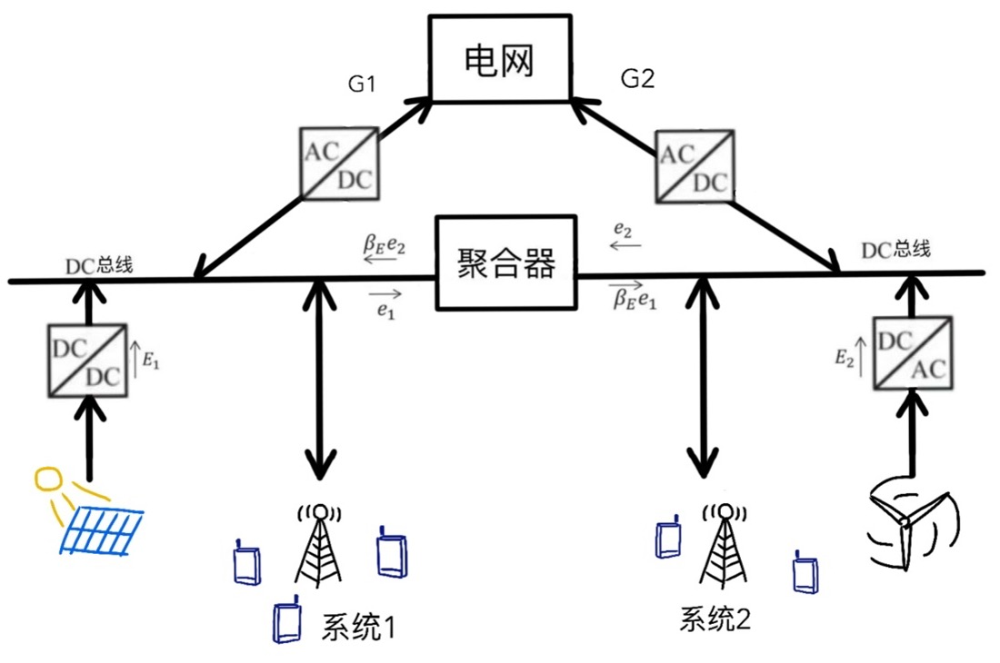
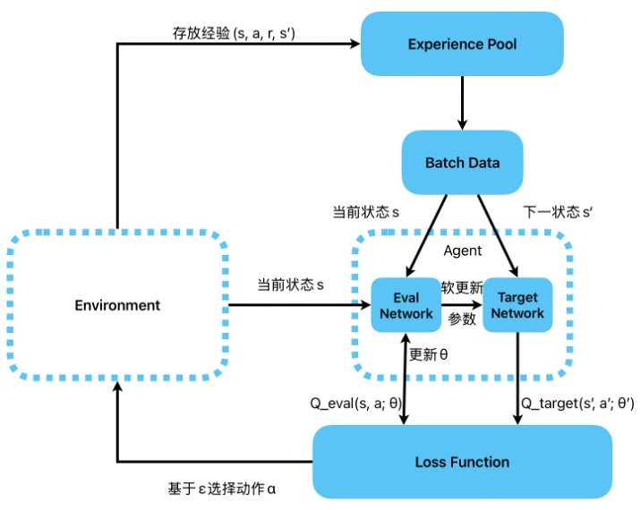
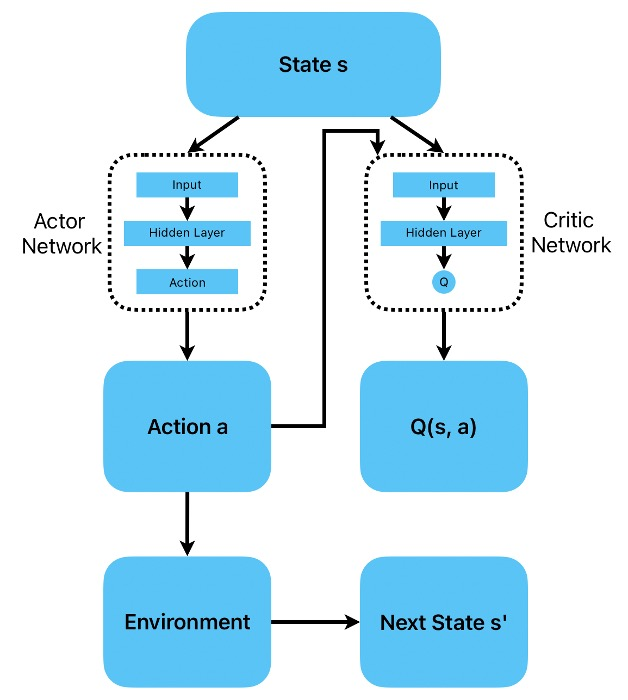
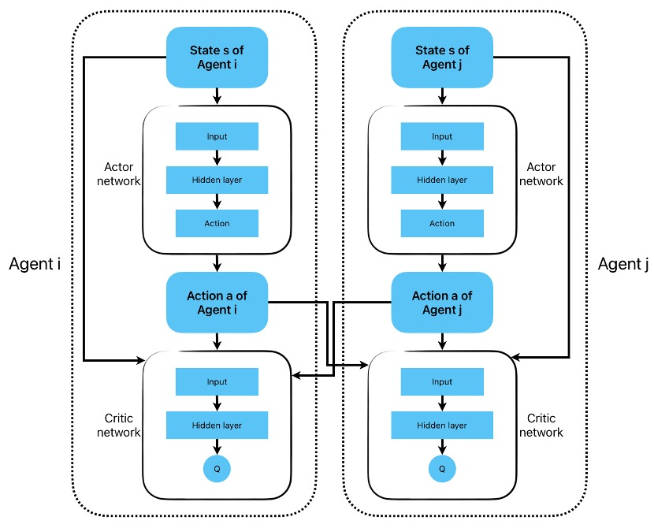
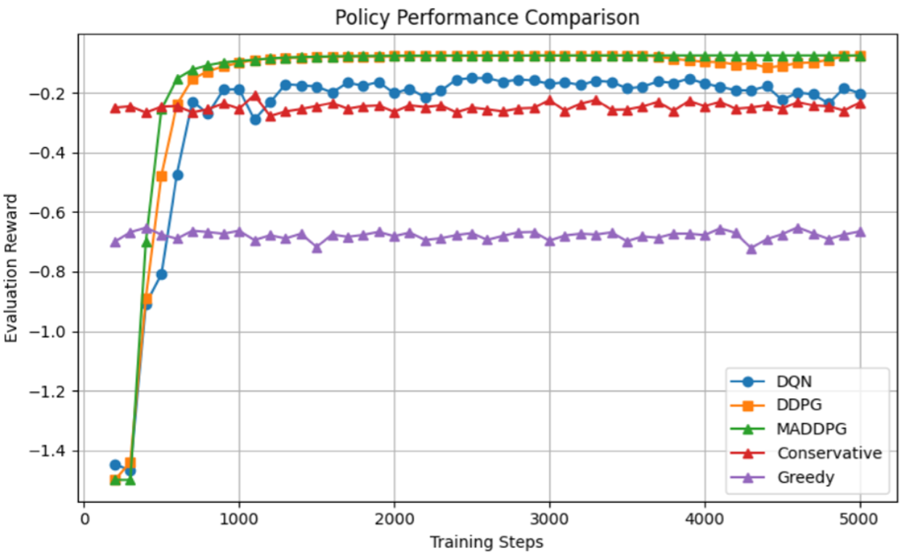
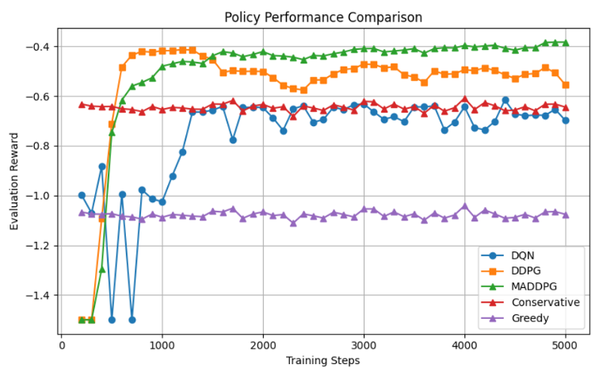
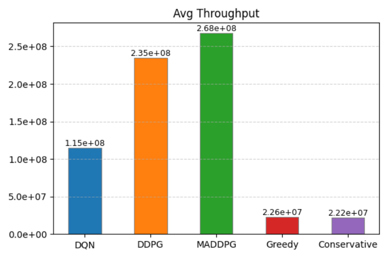
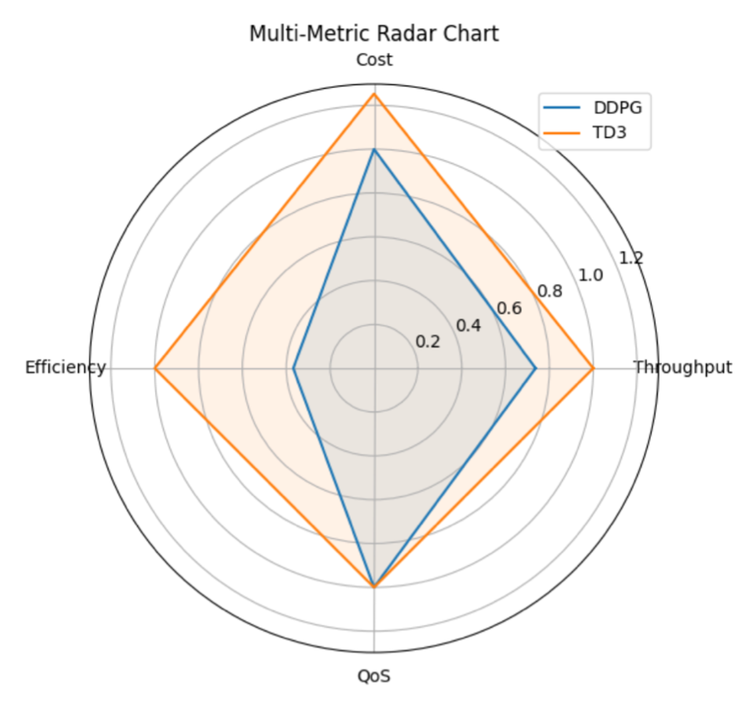

# Overview
  Based on the reinforcement learning framework, this project designs and compares a variety of classic and improved algorithms (DQN, DDPG, TD3, MADDPG, Greedy, Conservative) for the resource allocation problem of heterogeneous cellular networks powered by renewable energy.
  The performance of the algorithms in terms of throughput, cost, energy efficiency, QoS and other indicators is evaluated through simulation experiments.

## Methods

### System Model
- Two base stations + DC microgrid  
- Hybrid power supply (renewable + grid)  
- Joint energy and spectrum cooperation  

### Algorithms
- **Baseline Strategies**: Greedy, Conservative  
- **Reinforcement Learning**:
  - **DQN**: For discrete action spaces  
  - **DDPG**: For continuous action spaces with centralized training  
  - **MADDPG**: Multi-agent distributed cooperation  
  - **TD3**: Twin delayed DDPG, enhancing convergence and performance  

## Results

Simulation results compare **Greedy, Conservative, DQN, DDPG, MADDPG, and TD3**:

1. **Convergence of Reward Functions**
   - When the environment(amount of user, grid price, etc.) is static.
   
   
   - When the environment(amount of user, grid price, etc.) is oscillating.
   

3. **Throughput Comparison**  
   - DDPG improves throughput by ~20×  
   - MADDPG achieves ~15× in distributed scenarios  
   

4. **Energy Efficiency & Grid Dependency**  
   - Deep RL algorithms significantly reduce reliance on grid power  
   - Improve overall energy efficiency  
   

## File Structure
- `train_n_evaluate_2.py`   Main script for training, evaluation and visualization
- `environment_2.py`        Gym Environment Customization: BaseStationEnv
- `agents_2.py`             Implementation for different algorithms: DQN、DDPG、TD3、MADDPG、Greedy、Conservative
- `safety_2.py`             Safety Projection: Guarantee to meet the minimum requirements of QoS
- `common_2.py`             Common contents for different algorithms:Actor,Critic,ReplayMemory,SoftUpdate,etc.

## Requirements  
- Python 3.8+
- `numpy`
- `torch`
- `gym`
- `matplotlib`
- `scipy`

## Parameters
`train_n_evaluate_2.py`

| Parameter        | Value | Explanation                          |
|------------------|-------|--------------------------------------|
| `SEED`           | 5     | Random seed                         |
| `N`              | 2     | Base station amount                 |
| `TOTAL_STEPS`    | 5000  | Total training steps                 |
| `EVAL_INTERVAL`  | 100   | Steps between each two evaluations   |
| `EVAL_EPISODES`  | 100   | Episodes in every evaluation         |
| `MAX_STEPS`      | 50    | Steps in every episode               |
| `batch_size`     | 128   | Agent batch size                     |
| `tau`            | 0.005 | Soft update factor (TD3)             |
| `policy_noise`   | 0.2   | TD3 policy noise                     |
| `noise_clip`     | 0.5   | TD3 noise clip                       |
| `policy_delay`   | 2     | TD3 policy update delay              |
  
  
`environment_2.py`
| Parameter            | Value            | Explanation                              |
|----------------------|------------------|------------------------------------------|
| `max_energy`         | 40.0             | Maximum transit power for a base station |
| `max_bandwidth`      | 20e6             | Base station max bandwidth               |
| `max_renew`          | 20.0             | Max renewable energy                     |
| `grid_price`         | [0.3, 0.8, 1.2]  | Grid electricity price                   |
| `obs_noise_sigma`    | 0.02             | Standard deviation for observation       |
| `reward_noise_sigma` | 0.05             | Standard deviation for rewards           |
| `users_per_bs`       | random [2, 6]    | User amount for each base station        |

